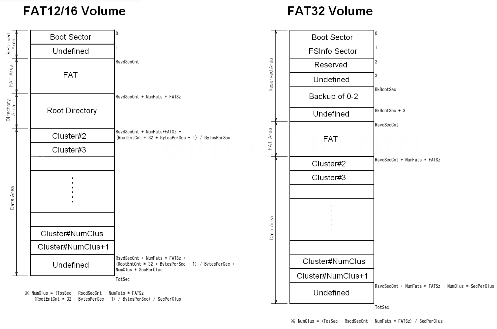

# fat32-impl
An implementation of the FAT32 file system.

The FAT volume is divided into three or four areas, each volume consists of 1 or more sectors which are 512 bytes each. The areas are stored as follows, first is the reserved area which contains the volume configuration data, next the file allocation table which contains the file allocation data for the data area, next is the root directory area which contains the root directory and other related information, lastly the data area contains the actual data.  

The data structures in the FAT filesystem is stored in little endian, this was because FAT was originally designed for Intel x86 PCs and x86 processors use little endian byte order. In this case storing multibyte values on the disk in little endian meant that the system could often read them directly without reordering the bytes. This project will also use little endian to preserve the file format so it is the same when read on any CPU architecture.  

Fields named `BPB` are part of the BIOS Parameter Block, fields labelled with `BS` is part of the boot sector, a layout of the FAT32 system is shown here (credit to elm-chan);

## FAT32

This implementation is based on the FAT32 layout of the filesystem, errors will be given in the case that the filesystem is given as FAT12 or 16 but will be properly handled, the main difference in the FAT32 and FAT12/16 systems is the maximum amount of sectors that the filesystem can hold, FAT32 uses 32 bit addresses for sectors and thus can hold up to 2TB of volume size in 512 byte sectors.  

FAT32 is the latest addition to the FAT family of filesystems, throughout the iterations, the last time the BPB was changed was on Windows 95 OSR2 where FAT32 was first added, at the time, the FAT16 had the maximum capacity for file systems of around 65536 sectors and around 2GB of volume, the FAT32 removed these limitations and also added a larger BPB, an FSINFO structure and a backup boot sector.

The FAT system is essentially just a linked list (the FAT) plus linear directory entries. It’s so easy to implement that every device on the planet supports it. 

## Tradeoffs

## Thoughts

## Resources
https://elm-chan.org/fsw/ff/
https://internals-for-interns.com/posts/fat32-filesystem/
https://elm-chan.org/docs/fat_e.html
https://academy.cba.mit.edu/classes/networking_communications/SD/FAT.pdf
